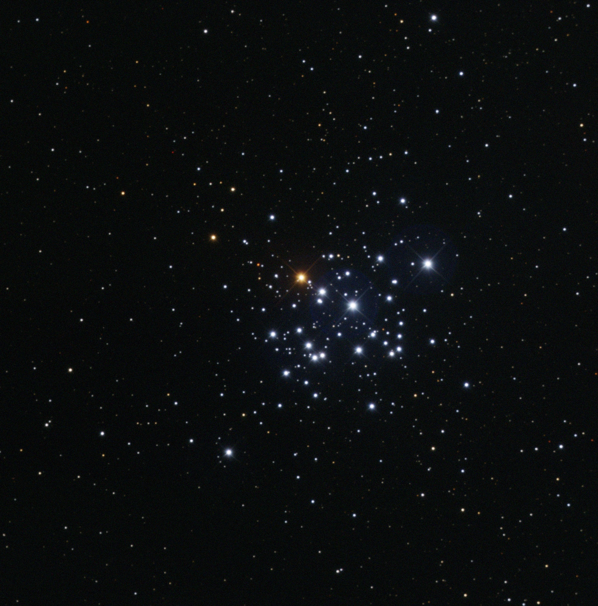
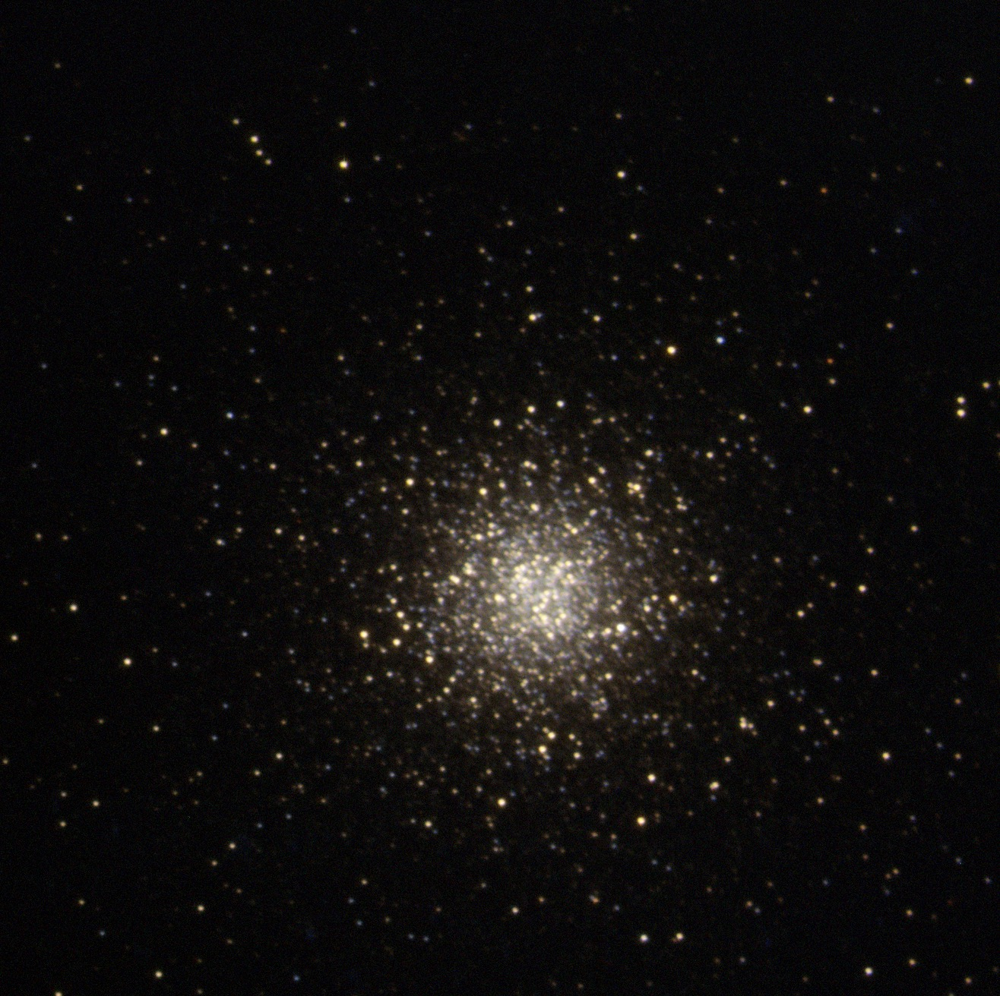
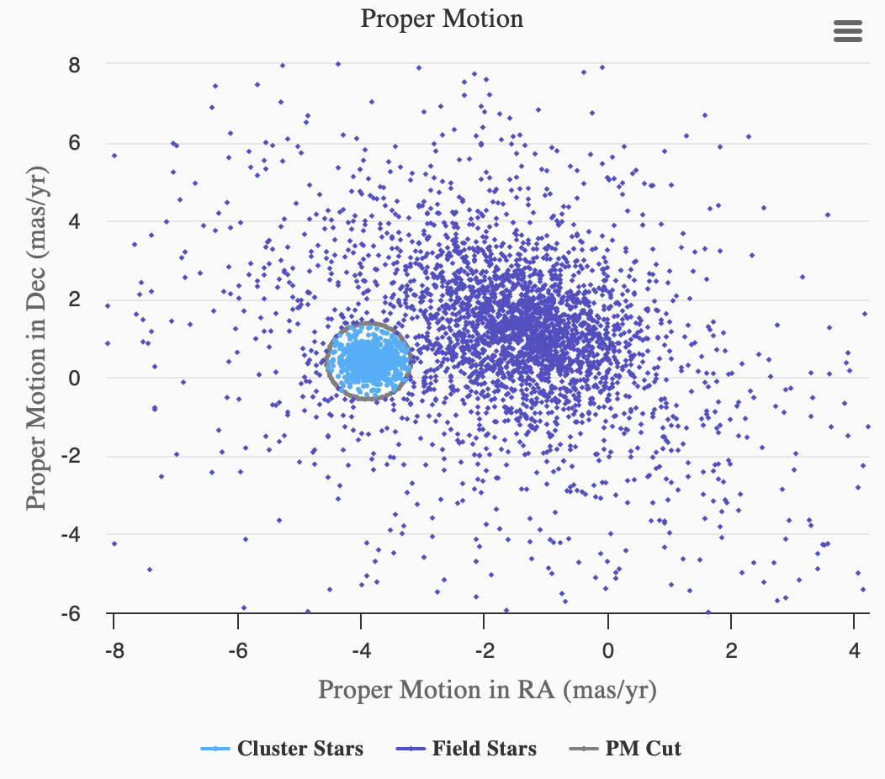

# Cluster Star Classifier (Using SVM)

This project serves as the final project for COMP562 (Intro to ML) at UNC-Chapel Hill 24 Spring.

## Star Clusters

[Star clusters](https://en.wikipedia.org/wiki/Star_cluster) are groups of stars held together by gravity.
They are interesting to astronomers because the stars within a cluster are usually formed at a similar time, and have
similar chemical compositions.
They also share common spatial parameters, sky-coordinates and distance are relatively trivial,
and they also share common proper motion (the direction and speed they are moving in the sky).

    
    

## Challenge

The assumption when studying a star cluster is that the stars you are studying are part of the cluster.
However, this is not always true, and isolating the cluster stars from the field stars is not trivial.

__The goal of this project is to build a classifier that can distinguish between cluster stars and field stars.__

## Approach

Part of the visualization tool [Clustermancer](https://astromancer.skynet.unc.edu/cluster) I built
for [Skynet](https://skynet.unc.edu/) is field star removal using proper motion. However, the tool is completely manual,
and relies on the judgement of the user to filter out field stars.

    

As we can see from the example above (NGC 2437), the stars form two Gaussian blobs in proper motion space.
The field stars have a bigger deviation, and the cluster stars are clearly separated with a unique mean.
This project aims to automate this process using machine learning, specifically Support Vector Machines (SVM).

## Data

The [GAIA mission](https://www.esa.int/Science_Exploration/Space_Science/Gaia) has provided us an open data set of
whole-sky photometry and astrometry with proper motion and distance.

The [Clustermancer](https://astromancer.skynet.unc.edu/cluster) mentioned above has a companion tool named
[Astronomicon](https://astronomicon.skynet.unc.edu) that allows users to submit Cluster analysis result from
Clustermancer and query. The community data from Astronomicon is used to label the GAIA data set.

More about data can be found in the
[data-prep.ipynb notebook](https://github.com/RuideFu/cluster-star-classifier/tree/main/data-generation/data-prep.ipynb).
